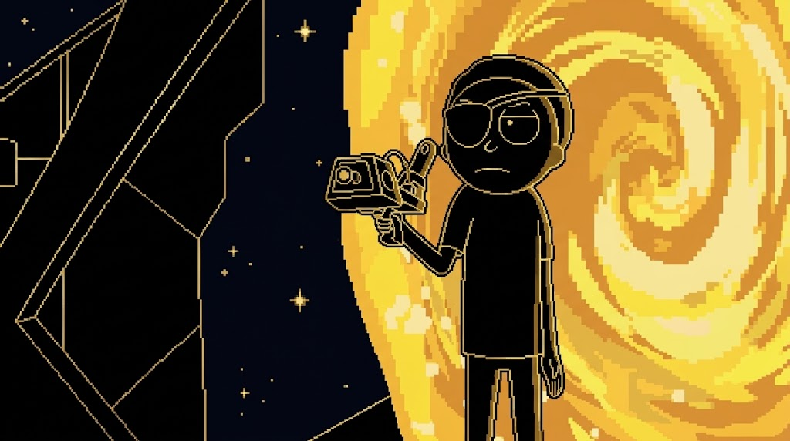

  

  
  
  

  
<strong>ArtX-Dev</strong>

  
👋 Hello! <strong>I'm Arthur França.</strong> I'm a technology enthusiast taking my first steps into the world of front-end web development

   
 
I am focused on building a solid foundation in core web technologies, transforming  ideas into real visual projects, and honing my skills with every line of code.

  

  <h1>statistics</h1>
  
     

  <h1>technologies</h1>
  
  

<picture data-importer="pacman">
  <source media="(prefers-color-scheme: dark)" srcset="https://raw.githubusercontent.com/imlima0299-lang/imlima0299-lang/pacman-output/bomberman-contribution-graph-dark.svg?game=bomberman">
  <source media="(prefers-color-scheme: light)" srcset="https://raw.githubusercontent.com/imlima0299-lang/imlima0299-lang/pacman-output/bomberman-contribution-graph.svg?game=bomberman">
  
</picture>
